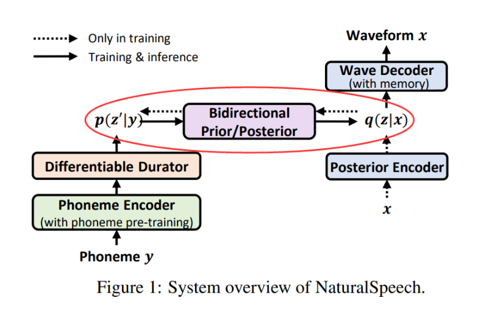

# Bert-VITS for Sophgo TPU

[VITS: Conditional Variational Autoencoder with Adversarial Learning for End-to-End Text-to-Speech](https://github.com/PlayVoice/vits_chinese)

Several recent end-to-end text-to-speech (TTS) models enabling single-stage training and parallel sampling have been proposed, but their sample quality does not match that of two-stage TTS systems. In this work, we present a parallel end-to-end TTS method that generates more natural sounding audio than current two-stage models. Our method adopts variational inference augmented with normalizing flows and an adversarial training process, which improves the expressive power of generative modeling. We also propose a stochastic duration predictor to synthesize speech with diverse rhythms from input text. With the uncertainty modeling over latent variables and the stochastic duration predictor, our method expresses the natural one-to-many relationship in which a text input can be spoken in multiple ways with different pitches and rhythms. A subjective human evaluation (mean opinion score, or MOS) on the LJ Speech, a single speaker dataset, shows that our method outperforms the best publicly available TTS systems and achieves a MOS comparable to ground truth.



## Environment setup

```bash
pip3 install -r requirements.txt

# if you want to export model
pip3 install -r requirements_model.txt

cd monotonic_align
mkdir monotonic_align
python3 setup.py build_ext --inplace
```

此例程`依赖sail`，安装方法请参考[Sail_Install_Guide](./docs/Sail_Install_Guide.md)

## Get model

you can download bmodel
```bash
# in this path (./VITS-TPU)
pip3 install dfss -i https://pypi.tuna.tsinghua.edu.cn/simple --upgrade
python3 -m dfss --url=open@sophgo.com:ezoo/vits/bmodel.zip
unzip bmodel.zip
```

[optional] or export by yourself
```bash
wget https://github.com/wangyifan2018/VITS-TPU/releases/download/v3.0/vits_bert_model.pth

python3 model_onnx.py --config configs/bert_vits.json --model vits_bert_model.pth

# source tpu-mlir first
# need to change model path
./scripts/gen_bmodel.sh
```

## Infer with sophgo bmodel

```bash
python3 vits_infer_sail.py --vits_model ./bmodel/vits_bert_128.bmodel --bert_model ./bmodel/bert_1684x_f32.bmodel --text_file vits_infer_item.txt --dev_id 0
```

./results have the waves inferred, listen !!!
